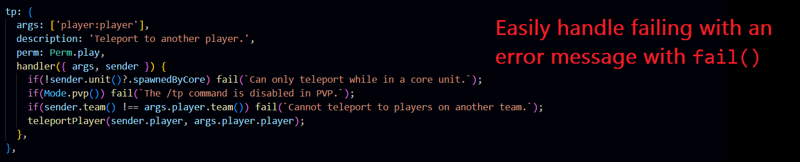

# Fish commands

A monolithic plugin that handles all custom features for the >|||>Fish servers. Created by Brandons404, rewritten by BalaM314.

**Before reading the code, see [docs/info.md](docs/info.md).**

## Clean and easy to use commands system
Example code:

List of notable features:
* Low-boilerplate argument handling system that supports arguments of various types, and optional arguments. Automatically generates an error if one of the args is invalid (eg, specifying a team that does not exist, or an ambiguous player name).
* Intellisense for the arguments (The IDE will see `args: ["team:team?"]` and correctly type `args.team` as `Team | null`)
* Callback-based menu system with builtin permission safety
* Command handlers are provided with the command's usage stats (how long ago the command was used, etc)
* Tap handling system
* Permission handling system
* Easy failing with fail() and its associated pattern
* Automatically allows using a menu to resolve arguments left blank

Interested in contributing? See [CONTRIBUTING.md](CONTRIBUTING.md), and thanks in advance!

Join our Discord: [https://discord.gg/VpzcYSQ33Y](https://discord.gg/VpzcYSQ33Y)

